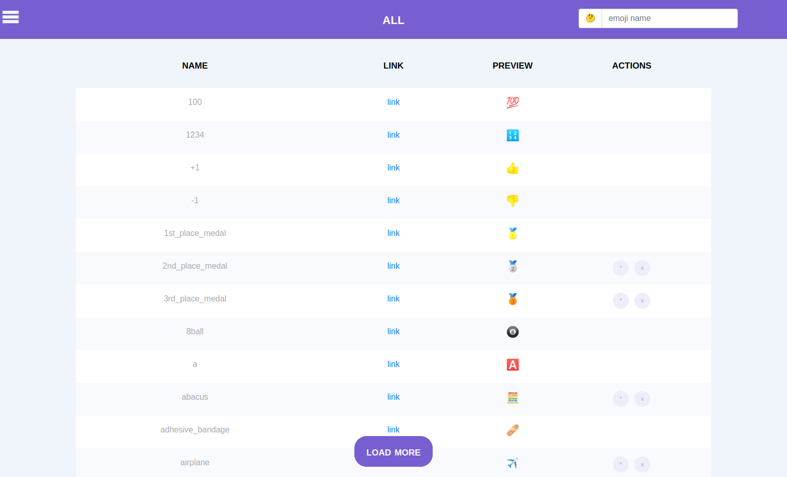
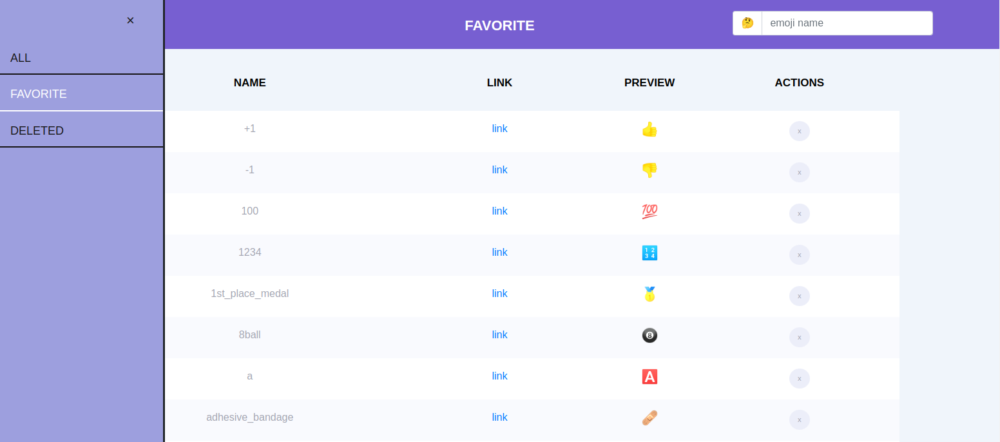
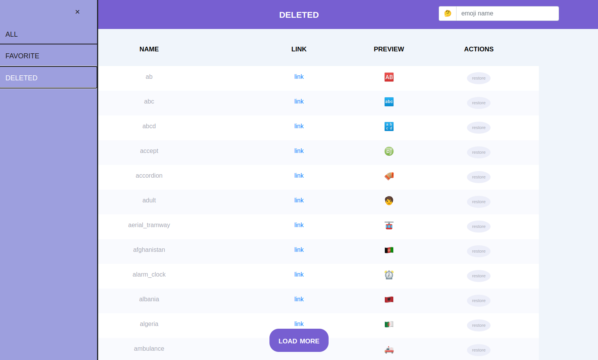
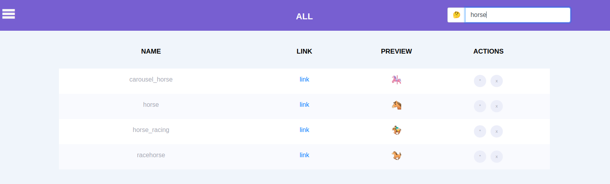

# emoji-lists
mini-app for managing lists of favorite and deleted emojis
# run
install angular 15+
```bash
cd app-root
ng serve
```
# preview
## start page

## favorite list

## deleted list

## search example
